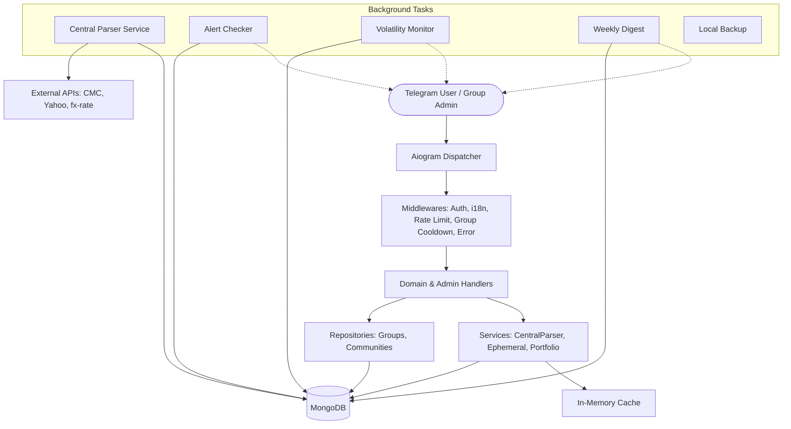

[← Back to docs index](README.md)

# Architecture Overview

The `teferdet/finances` bot is built using Python 3.12+ and the [aiogram 3.x](https://docs.aiogram.dev/) asynchronous framework. It is designed to be highly concurrent, resilient, and responsive to private messages, group chats, and Bot API 10.x guest queries.

## Core Components

The system architecture is divided into the following layers:

1. **Entry Point & Orchestration:**
   - `app/__main__.py`: The primary entry point. Initializes configurations, establishes database connections, starts background services (central parser, alerts, digest, backups), and starts the Telegram bot polling loop.
   - `app/bot.py`: Configures the Telegram `Bot` and `Dispatcher`, attaching middlewares (`i18n`, `rate_limit`, `throttle`, `group_cooldown`, `error`) and registering all feature routers.

2. **Routing & Handlers (`app/handlers/`):**
   - Instead of a monolithic structure, the bot uses `aiogram`'s Router architecture. Handlers are grouped by domain (e.g., `crypto.py`, `portfolio.py`, `alerts.py`, `group_admin.py`, `admin_groups.py`, `guest.py`).
   - Private, group, and guest updates (`F.guest_query_id`) are filtered at the router level.

3. **Repositories (`app/repositories/`):**
   - Encapsulates database access for complex domain objects.
   - `groups.py`: Manages group chat configurations, member tracking, settings overrides, and usage stats.
   - `communities.py`: Handles Telegram Bot API 10.2 Community structures, linking groups under parent organizational entities.

4. **Background Services & Central Parser (`app/services/`):**
   - `parser_service.py` (`CentralParserService`): Central orchestrator for background currency refresh and on-demand conversion.
   - `ephemeral_service.py`: Handles self-deleting message lifecycle for clean UI interactions in groups.
   - `analytics_reporter.py`: Aggregates usage metrics for system and group administrators.
   - Core async loops: Alert checking, volatility monitoring, weekly portfolio digests, and automated MongoDB backups.

5. **Data Persistence (MongoDB & Motor):**
   - Asynchronous MongoDB interactions via `motor`.
   - Collections: `Users`, `Groups`, `Communities`, `Alerts`, `fiat_rates`, `current_prices`, `price_history`, `ApiKeys`, `Status`, `ProblematicSources`.
   - Lazy data structure migrations run on-the-fly where necessary.

6. **Caching Layer (`app/cache.py`):**
   - Asynchronous in-memory cache reducing database load for `currencies_info` and temporary UI navigation state.

## Data Flow Diagram

## System Constraints & Security
- **Rate Limiting & Cooldowns:** Protects private and group channels from spam (`rate_limit.py`, `group_cooldown.py`).
- **Bot API 10.x Guest Mode:** Safe single-message query evaluation for `@bot` mentions in non-member chats (`guest.py`).
- **Cloudflare Bypass:** Uses `curl_cffi` with browser fingerprinting to scrape fiat rates securely.
- **API Secret Encryption:** Symmetrically encrypts user exchange secrets (`Fernet`) before storing in database (`security.py`).

---

*Last updated: 2026-07-22*

