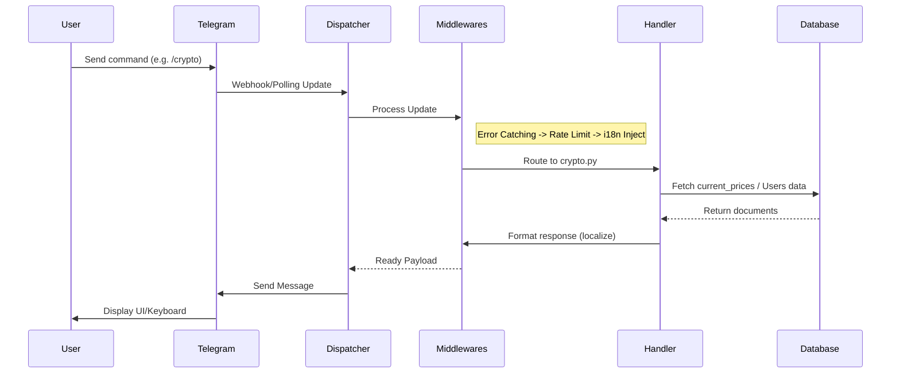

# 🏗 Architecture

**TL;DR:** Finances is an asynchronous Telegram bot built with Python (`aiogram` 3.x) and MongoDB (`motor`). It features a multi-layered middleware architecture, background data scraping using `curl_cffi`, and background schedulers for alerts, volatility monitoring, and system backups.

## System Overview

The application is structured into several core layers:
- **Bot & Dispatcher (`bot.py`)**: Initializes the aiogram `Bot` and `Dispatcher`, injecting global middlewares (Error, I18n, RateLimit, GroupCooldown) and registering all command routers.
- **Routers (`handlers/`)**: Contain the actual logic for responding to Telegram updates (e.g., `start`, `crypto`, `portfolio`, `admin`).
- **Services (`services/`)**: Background loops that run independently of the Telegram long-polling (parsers, alerts, digest scheduler).
- **Database (`db.py`)**: Asynchronous MongoDB operations utilizing connection pooling.
- **Configuration (`config.py`)**: Typified dataclasses loading data from `config/settings.json` and `config/data.json` at runtime.

## Data Flow Diagram

## Parsing Engine (`curl_cffi`)

The bot requires live currency and asset rates. Instead of standard `aiohttp` or `requests`, the parser service utilizes **`curl_cffi`**.
- **Why `curl_cffi`?** It impersonates a real browser's TLS/JA3 fingerprints. Many financial data sources (like `fx-rate.net`) use Cloudflare or similar anti-bot protection. `curl_cffi` bypasses these restrictions effectively.
- **Flow**: The parser runs as an asynchronous background loop (`run_parser_loop()`), fetching data at intervals defined in `settings.parser.update_interval_sec`.

## Background Schedulers

The entry point (`__main__.py`) initiates several asynchronous background tasks via `asyncio.create_task()` before starting the aiogram polling:

| Task Name | Function | Interval | Description |
|-----------|----------|----------|-------------|
| **Parser** | `run_parser_loop()` | `parser.update_interval_sec` | Scrapes fresh fiat/crypto rates and caches them in MongoDB. |
| **Alerts** | `run_alert_checker()` | 60 seconds | Checks if any user-defined price targets (`Alerts` collection) have been reached. |
| **Volatility** | `run_volatility_monitor()` | 300 seconds | Analyzes `price_history` to detect sudden price spikes/drops for assets in user portfolios. |
| **Digest** | `run_digest_scheduler()` | Scheduled | Prepares and sends scheduled analytics reports (🚧 In Progress). |
| **Analytics** | `AnalyticsReporter.start()` | Scheduled | Background aggregation of user activity metrics. |
| **Backup** | `run_daily_backup_loop()` | 24 hours | Performs a localized dump of the MongoDB data (if `backup_enabled` is true). |
