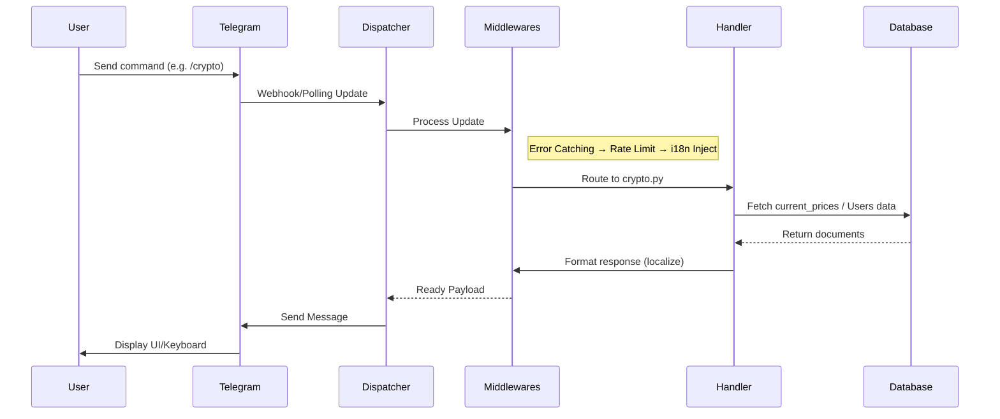
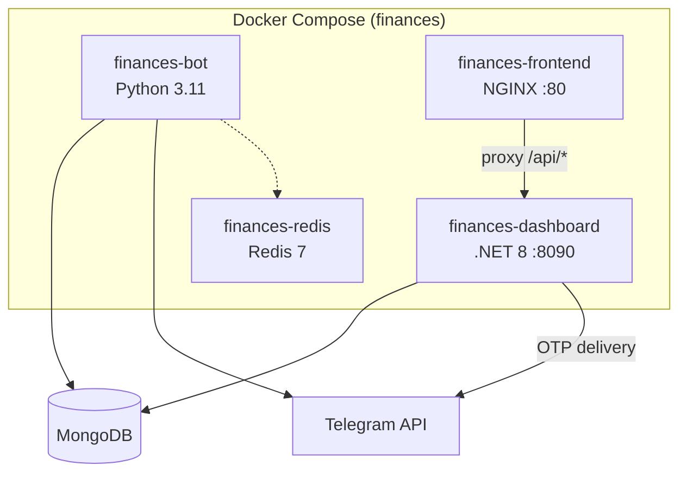

[← Back to docs index](README.md)

# 🏗 Architecture

**TL;DR:** Finances is an asynchronous Telegram bot built with Python (`aiogram` 3.x) and MongoDB (`motor`), accompanied by a .NET 8 web dashboard. It features a multi-layered middleware architecture, background data scraping using `curl_cffi`, background schedulers for alerts, volatility monitoring, weekly digests, and system backups. An optional Redis layer provides shared caching.

## System Overview

The project consists of two main applications:

### 1. Telegram Bot (Python)
- **Bot & Dispatcher (`bot.py`)**: Initializes the aiogram `Bot` and `Dispatcher`, injecting global middlewares (Error, I18n, RateLimit, GroupCooldown) and registering all command routers.
- **Routers (`handlers/`)**: Contain the actual logic for responding to Telegram updates (e.g., `start`, `crypto`, `portfolio`, `admin`).
- **Services (`services/`)**: Background loops that run independently of the Telegram long-polling (parsers, alerts, digest scheduler).
- **Repositories (`repositories/`)**: Database access layer for Groups and Communities entities.
- **Database (`db.py`)**: Asynchronous MongoDB operations utilizing connection pooling.
- **Configuration (`config.py`)**: Typed dataclasses loading data from `config/settings.json` and `config/data.json` at runtime, with automatic reload on file changes.
- **Cache (`cache.py` + `redis_client.py`)**: In-memory TTL cache with optional Redis backend. Redis is enabled via `settings.redis.url`; when unavailable, all operations transparently fall back to in-process `MemoryCache`.

### 2. Admin Dashboard (C# + React)
- **API (`dashboard/API/`)**: .NET 8 ASP.NET Core REST API providing authentication (Telegram OTP + JWT), statistics aggregation, configuration management, and operational actions.
- **Frontend (`dashboard/frontend/`)**: React 18 + MUI 9 SPA served via NGINX, communicating with the API via reverse proxy.
- See [Dashboard](DASHBOARD.md), [Dashboard API](DASHBOARD_API.md), and [Dashboard Frontend](DASHBOARD_FRONTEND.md) for details.

## Data Flow Diagram

## Parsing Engine (`curl_cffi`)

The bot requires live currency and asset rates. Instead of standard `aiohttp` or `requests`, the parser service utilizes **`curl_cffi`**.
- **Why `curl_cffi`?** It impersonates a real browser's TLS/JA3 fingerprints. Many financial data sources (like `fx-rate.net`) use Cloudflare or similar anti-bot protection. `curl_cffi` bypasses these restrictions effectively.
- **Flow**: The parser runs as an asynchronous background loop (`run_parser_loop()`), fetching data at intervals defined in `settings.parser.update_interval_sec`.

## Background Schedulers

The entry point (`__main__.py`) initiates several asynchronous background tasks via `asyncio.create_task()` before starting the aiogram polling:

| Task Name | Function | Interval | Description |
|-----------|----------|----------|-------------|
| **Parser** | `run_parser_loop()` | `parser.update_interval_sec` | Scrapes fresh fiat/crypto rates and caches them in MongoDB. |
| **Alerts** | `run_alert_checker()` | 60 seconds | Checks if any user-defined price targets (`Alerts` collection) have been reached. |
| **Volatility** | `run_volatility_monitor()` | 300 seconds | Analyzes `price_history` to detect sudden price spikes/drops for assets in user portfolios. |
| **Digest** | `run_digest_scheduler()` | 30 min eval / Sunday 10:00 UTC | Prepares and sends weekly portfolio digest reports to users. |
| **Analytics** | `AnalyticsReporter.start()` | Scheduled | Background aggregation of user activity metrics. |
| **Backup** | `run_daily_backup_loop()` | Daily at 03:00 UTC | Performs a localized dump of the MongoDB data (if `backup_enabled` is true). |

## Configuration Architecture

Settings are loaded from `config/settings.json` into frozen Python dataclasses via `get_settings()`. The cache auto-reloads when the file's modification time changes. The full typed hierarchy:

| Dataclass | Key Fields |
|---|---|
| `BotSettings` | `token`, `admin_ids`, `backup_enabled`, `version` |
| `DatabaseSettings` | `mongo_uri`, `mongo_database`, `pool_min`, `pool_max` |
| `ParserSettings` | `auto_update`, `update_interval_sec`, `critical_currencies`, `retry_attempts` |
| `SecuritySettings` | `rate_limit_requests`, `rate_limit_window_sec`, `fernet_key` |
| `FeaturesSettings` | `mini_app_enabled`, `groups_enabled`, `inline_mode_enabled` |
| `DraftSettings` | `enabled`, `loading_threshold_sec`, `animation_interval_sec` |
| `RedisSettings` | `url`, `max_connections`, `socket_timeout` |
| `SentrySettings` | `dsn`, `environment`, `traces_sample_rate` |
| `I18nSettings` | `supported_languages`, `default_language` |

## Docker Architecture

---

*Last updated: 2026-08-19*
