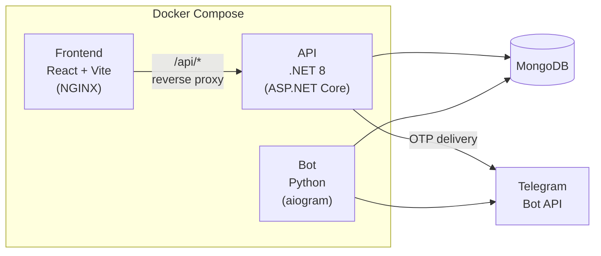
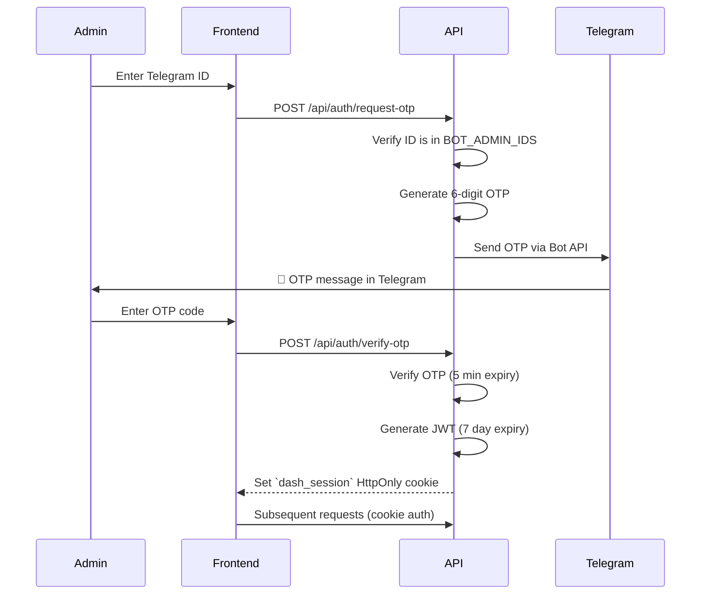

[← Back to docs index](README.md)

# 📊 Dashboard Overview

The **Finances Dashboard** is a web-based admin panel that provides system administrators with real-time monitoring, analytics, configuration management, and operational controls for the Telegram bot — all through a browser interface.

## Architecture

The dashboard is a **three-tier** application:



| Layer | Technology | Port | Container |
|---|---|---|---|
| **Frontend** | React 18 + MUI 9 + Vite 6 + Recharts | `80` (NGINX) | `finances-frontend` |
| **API** | .NET 8 (ASP.NET Core) + MongoDB.Driver | `8090` | `finances-dashboard` |
| **Bot** | Python 3.11 + aiogram 3.x + Motor | — | `finances-bot` |
| **Cache** | Redis 7 (optional) | `6379` | `finances-redis` |

All services share a single MongoDB instance and communicate through the `finances_net` Docker bridge network. The frontend NGINX container reverse-proxies all `/api/*` requests to the .NET API backend.

## Authentication Flow

The dashboard uses a **Telegram-based OTP (One-Time Password)** authentication scheme. Only users whose Telegram IDs are listed in `BOT_ADMIN_IDS` can access the dashboard.



### Security Mechanisms

| Feature | Implementation |
|---|---|
| **Admin verification** | Telegram ID checked against `BOT_ADMIN_IDS` env variable |
| **OTP delivery** | Sent via Telegram Bot API (`sendMessage`) to the admin's personal chat |
| **OTP expiry** | 5 minutes, single-use, stored in MongoDB `Otps` collection |
| **Session token** | JWT (HS256), 7-day expiry, stored as `dash_session` HttpOnly cookie |
| **JWT validation** | Issuer/Audience: `FinancesDashboard`, minimum 32-char secret key |
| **NGINX rate limiting** | Auth endpoints: 10 req/min, API endpoints: 60 req/min |
| **Security headers** | X-Frame-Options, CSP, X-Content-Type-Options, Referrer-Policy |

## Dashboard Pages

The dashboard provides 9 functional pages accessible via a sidebar navigation:

| Page | Description |
|---|---|
| **Overview** | KPI cards (Total Users, DAU, WAU, MAU, Premium, Groups, Alerts, Requests), 30-day activity chart |
| **Bot Status** | Service status, RAM/CPU usage, system resources, disk, Python version, uptime |
| **Database** | MongoDB metrics — collection sizes, document counts, index sizes, connection pool stats |
| **Parser** | Fiat/Crypto/Stocks parser health, last update timestamps, parser error log, cycle count |
| **Alerts** | Active/triggered price alerts statistics, top currencies breakdown |
| **Groups** | Active/inactive group counts, recent group registrations list |
| **Errors** | Real-time error log viewer with timestamps and severity levels |
| **Users** | Language distribution (pie chart), top users by request volume |
| **Config** | Live `settings.json` editor with section-level saves and feature flag toggles |

## Configuration

### Environment Variables

The dashboard API reads its configuration from environment variables (populated from `.env` or Docker Compose):

| Variable | Required | Description |
|---|---|---|
| `MONGO_URI` | ✅ | MongoDB connection string |
| `MONGO_DATABASE` | ❌ | Database name (default: `finances`) |
| `BOT_TOKEN` | ✅ | Telegram Bot API token (for OTP delivery) |
| `BOT_ADMIN_IDS` | ✅ | Comma-separated admin Telegram IDs |
| `JWT_SECRET` / `DASHBOARD_SECRET_KEY` | ✅ | JWT signing key (min 32 chars) |
| `CONFIG_PATH` | ❌ | Path to `settings.json` (default: `../../config/settings.json`) |

### Config Safety

The dashboard API masks sensitive fields when returning configuration to the frontend:
- `bot.token` → `**********************`
- `database.mongo_uri` → `mongodb://**********************`

Editing of `api_keys`, `bot`, `database`, and `security` sections via the dashboard is **blocked** (HTTP 403).

## Deployment

### Docker Compose (Recommended)

The dashboard is deployed alongside the bot using the project's `docker-compose.yml`:

```bash
docker compose up -d
```

This starts 4 containers:
1. `finances-bot` — Telegram bot
2. `finances-dashboard` — .NET 8 API (port 8090, internal)
3. `finances-frontend` — NGINX serving React SPA + reverse proxy (port 80)
4. `finances-redis` — Optional Redis cache

### Standalone (systemd)

For legacy deployments, the API can run as a systemd service using `dashboard/finances-dashboard.service`. The React frontend is served by a dedicated NGINX config (`dashboard/nginx/finances-dashboard.conf`).

### NGINX Reverse Proxy

The NGINX configuration handles:
- **SPA routing** — all non-API paths fall through to `index.html`
- **Asset caching** — Vite-hashed `/assets/` files cached for 1 year with `immutable`
- **Rate limiting** — separate zones for auth (10 req/min) and general API (60 req/min)
- **Security headers** — comprehensive CSP, XSS protection, and frame denial
- **Gzip compression** — enabled for text, JSON, JS, CSS, and SVG
- **Error handling** — JSON responses for 429 and 5xx errors

---

*Last updated: 2026-08-19*
