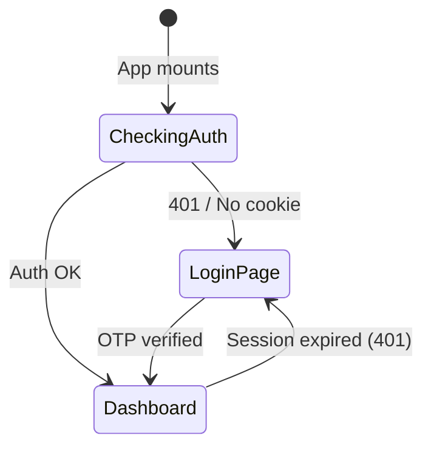

[← Back to docs index](README.md)

# 🖥️ Dashboard Frontend

The Dashboard Frontend is a **React 18** single-page application (SPA) built with **Vite 6**, **MUI (Material UI) 9**, and **Recharts**. It provides a rich, interactive admin interface for monitoring and managing the Finances bot.

## Technology Stack

| Component | Technology | Version |
|---|---|---|
| **UI Framework** | React | 18.3 |
| **Build Tool** | Vite | 6.1 |
| **Component Library** | MUI (Material UI) | 9.3 |
| **Data Grid** | MUI X Data Grid | 9.11 |
| **Charts** | Recharts | 2.15 |
| **Icons** | MUI Icons + Lucide React | 9.3 / 0.475 |
| **Styling** | Emotion (CSS-in-JS) | 11.14 |
| **Language** | TypeScript | 5.7 |

## Project Structure

```
dashboard/frontend/
├── index.html                    # HTML entry point
├── package.json                  # Dependencies and scripts
├── tsconfig.json                 # TypeScript configuration
├── vite.config.ts                # Vite config (aliases, proxy, build)
├── nginx.conf                    # Production NGINX config (Docker)
├── Dockerfile.frontend           # Docker build for NGINX serving
├── src/
│   ├── main.tsx                  # React DOM root mount
│   ├── App.tsx                   # Root component — auth gate, routing, data fetching
│   ├── index.css                 # Global CSS styles
│   ├── api/
│   │   └── client.ts             # API client — typed fetch wrapper + all endpoint calls
│   ├── lib/
│   │   └── utils.ts              # Utility functions
│   ├── hooks/                    # Custom React hooks (empty — reserved)
│   └── components/
│       ├── auth/
│       │   └── LoginPage.tsx     # Telegram OTP login flow (2-step)
│       ├── layout/
│       │   ├── Sidebar.tsx       # Navigation sidebar with status badges
│       │   └── Header.tsx        # Top bar — page title, refresh, logout, restart
│       ├── pages/
│       │   ├── OverviewPage.tsx  # KPI cards + activity chart
│       │   ├── BotStatusPage.tsx # Process stats + system resources
│       │   ├── DatabasePage.tsx  # Collection stats table
│       │   ├── ParserPage.tsx    # Parser health + error list
│       │   ├── AlertsPage.tsx    # Alert statistics
│       │   ├── GroupsPage.tsx    # Group management stats
│       │   ├── ErrorsPage.tsx    # Error log viewer
│       │   ├── UsersPage.tsx     # Language distribution + top users
│       │   └── ConfigPage.tsx    # Live config editor + feature toggles
│       └── ui/                   # Shared UI components (reserved)
```

## Application Architecture

### Root Component (`App.tsx`)

The `App` component manages the entire application lifecycle:



**Key responsibilities:**

1. **Auth gate** — attempts to call `/api/stats/overview` on mount. If it succeeds, the user is authenticated. If 401, redirect to login.
2. **Hash routing** — URL hash (`#overview`, `#bot`, `#database`, etc.) determines the active page. Navigation updates `window.location.hash`.
3. **Data fetching** — `fetchPageData()` loads data for the current page on mount, page change, and on a 30-second auto-refresh interval.
4. **State management** — all data is stored in React `useState` hooks. No external state library.

### API Client (`api/client.ts`)

The API client is a single module exporting:

1. **TypeScript interfaces** for all API response types:
   - `OverviewStats`, `ActivityPoint`, `BotStatus`, `DatabaseStats`, `ParserStatus`
   - `AlertsStats`, `GroupsStats`, `ErrorLogEntry`, `ConfigData`
   - `UserLanguageStat`, `TopUser`, `CollectionStat`, `ParserError`

2. **Generic `req<T>()` function** — typed fetch wrapper that:
   - Sends `Content-Type: application/json`
   - Includes credentials (cookies) via `credentials: 'include'`
   - Parses JSON responses
   - Throws errors with `status` property for auth handling

3. **`api` object** with methods for every endpoint:

| Method | Endpoint | Description |
|---|---|---|
| `requestOtp(id)` | `POST /api/auth/request-otp` | Initiate OTP login |
| `verifyOtp(id, otp)` | `POST /api/auth/verify-otp` | Verify OTP code |
| `checkStatus(reqId)` | `GET /api/auth/check-status` | Poll approval status |
| `logout()` | `POST /api/auth/logout` | End session |
| `health()` | `GET /api/health` | Health check |
| `getOverview()` | `GET /api/stats/overview` | Dashboard KPIs |
| `getActivity(days)` | `GET /api/stats/activity` | Activity chart data |
| `getUsers()` | `GET /api/stats/users` | User statistics |
| `getDatabase()` | `GET /api/stats/database` | MongoDB stats |
| `getBotStatus()` | `GET /api/stats/bot` | Bot process info |
| `getParserStatus()` | `GET /api/stats/parser` | Parser health |
| `getAlerts()` | `GET /api/stats/alerts` | Alert stats |
| `getGroups()` | `GET /api/stats/groups` | Group stats |
| `getErrors()` | `GET /api/stats/errors` | Error log |
| `getConfig()` | `GET /api/config` | Read config |
| `updateConfigSection(section, settings)` | `POST /api/config/update` | Update config |
| `patchFeature(feature, value)` | `PATCH /api/config/features` | Toggle feature |
| `restartBot()` | `POST /api/actions/restart` | Restart bot service |

## Pages

### Login Page (`LoginPage.tsx`)

Two-step authentication flow:

1. **Step 1**: Admin enters their Telegram User ID. The frontend calls `requestOtp()` which sends a 6-digit OTP to their Telegram chat.
2. **Step 2**: Admin enters the 6-digit OTP using individual digit inputs. Background polling checks for approval status while the admin can also manually enter the code.

### Overview Page (`OverviewPage.tsx`)

- **KPI cards**: Total Users, DAU, WAU, MAU, Premium users, Active Groups, Active Alerts, Requests Today/Week, Errors Today, Parser Cycles, Retention Rate.
- **Activity chart**: 30-day Recharts line chart showing DAU and request volume trends.

### Bot Status Page (`BotStatusPage.tsx`)

- **Service status**: Running/stopped indicator with uptime since `started_at`.
- **Bot process metrics**: RAM (MB), CPU (%), PID, thread count.
- **System resources**: Total/used RAM (GB), CPU (%), core count, load averages (1m, 5m).
- **Disk**: Used/total (GB), usage percentage.
- **Info**: OS, Python version, hostname, bot version.

### Database Page (`DatabasePage.tsx`)

- **Summary cards**: Total size (MB), storage size, index size, collection count, connections (current/available), MongoDB version.
- **Collections table**: Per-collection breakdown — name, document count, size (KB), average document size (bytes).

### Config Page (`ConfigPage.tsx`)

- **Section editors**: Expandable panels for `parser`, `i18n`, `security`, `features`, `draft`, `redis`, `sentry` sections.
- **Feature toggles**: Inline boolean switches for `mini_app_enabled`, `groups_enabled`, `inline_mode_enabled`.
- **Read-only sections**: `bot`, `database`, `api_keys`, `security` are displayed but cannot be edited.

## Build & Development

### Development Server

```bash
cd dashboard/frontend
npm install
npm run dev
```

Starts Vite dev server on `http://localhost:5173` with hot module replacement. API calls are proxied to `http://127.0.0.1:8090` via Vite's built-in proxy.

### Production Build

```bash
npm run build
```

Outputs optimized assets to `dashboard/frontend/dist/` with:
- **Code splitting**: `vendor` (React/ReactDOM), `charts` (Recharts), `icons` (Lucide) as separate chunks.
- **Source maps**: Disabled in production.
- **TypeScript**: Compiled via `tsc` before Vite bundling.

### Docker Build

The `Dockerfile.frontend` copies `dist/` into an NGINX container and applies the custom `nginx.conf` for SPA routing and asset caching.

## Path Aliases

Vite is configured with a `@` path alias pointing to `./src/`:

```typescript
// vite.config.ts
resolve: {
  alias: {
    '@': path.resolve(__dirname, './src'),
  },
}
```

This enables clean imports like `import { api } from '@/api/client'` instead of relative paths.

---

*Last updated: 2026-08-19*
