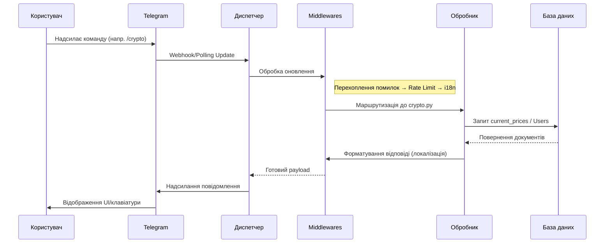
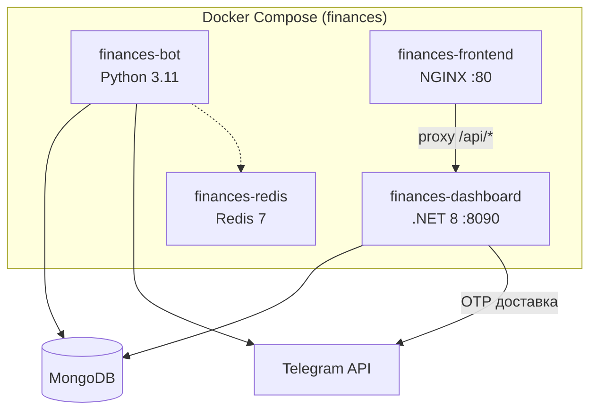

[← Повернутися до змісту](README.md)

# 🏗 Архітектура

**Коротко:** Finances — це асинхронний Telegram-бот, побудований на Python (`aiogram` 3.x) та MongoDB (`motor`), з додатковим веб-дашбордом на .NET 8. Має багаторівневу архітектуру middleware, фонове збирання даних через `curl_cffi`, фонові планувальники для алертів, моніторингу волатильності, щотижневих дайджестів і системних бекапів. Опціональний Redis забезпечує спільне кешування.

## Огляд системи

Проєкт складається з двох основних застосунків:

### 1. Telegram-бот (Python)
- **Бот і Диспетчер (`bot.py`)**: Ініціалізує aiogram `Bot` та `Dispatcher`, впроваджуючи глобальні middleware (Error, I18n, RateLimit, GroupCooldown) та реєструючи всі роутери команд.
- **Роутери (`handlers/`)**: Містять логіку реагування на оновлення Telegram (напр., `start`, `crypto`, `portfolio`, `admin`).
- **Сервіси (`services/`)**: Фонові цикли, що працюють незалежно від Telegram long-polling (парсери, алерти, планувальник дайджестів).
- **Репозиторії (`repositories/`)**: Шар доступу до бази даних для сутностей Groups та Communities.
- **База даних (`db.py`)**: Асинхронні операції MongoDB з використанням пулу з'єднань.
- **Конфігурація (`config.py`)**: Типізовані dataclass-и, що завантажують дані з `config/settings.json` та `config/data.json` з автоматичним перезавантаженням при зміні файлів.
- **Кеш (`cache.py` + `redis_client.py`)**: Внутрішній TTL-кеш з опціональним Redis-бекендом. Redis вмикається через `settings.redis.url`; якщо недоступний — операції прозоро працюють через `MemoryCache`.

### 2. Адмін-дашборд (C# + React)
- **API (`dashboard/API/`)**: .NET 8 ASP.NET Core REST API для автентифікації (Telegram OTP + JWT), агрегації статистики, управління конфігурацією та операційних дій.
- **Фронтенд (`dashboard/frontend/`)**: React 18 + MUI 9 SPA, обслуговується NGINX, спілкується з API через reverse proxy.
- Детальніше: [Дашборд](DASHBOARD.md), [API дашборда](DASHBOARD_API.md), [Фронтенд дашборда](DASHBOARD_FRONTEND.md).

## Діаграма потоку даних

## Парсер (`curl_cffi`)

Бот потребує актуальних курсів валют і цін активів. Замість стандартних `aiohttp` чи `requests`, парсер використовує **`curl_cffi`**.
- **Чому `curl_cffi`?** Він імітує TLS/JA3-відбитки справжнього браузера. Багато джерел фінансових даних (як `fx-rate.net`) використовують Cloudflare або подібний антибот-захист. `curl_cffi` ефективно обходить ці обмеження.
- **Потік**: Парсер працює як асинхронний фоновий цикл (`run_parser_loop()`), отримуючи дані з інтервалами, визначеними в `settings.parser.update_interval_sec`.

## Фонові планувальники

Точка входу (`__main__.py`) ініціює кілька асинхронних фонових задач через `asyncio.create_task()` перед запуском aiogram polling:

| Назва задачі | Функція | Інтервал | Опис |
|-----------|----------|----------|-------------|
| **Парсер** | `run_parser_loop()` | `parser.update_interval_sec` | Збирає свіжі курси фіат/крипто та кешує їх у MongoDB. |
| **Алерти** | `run_alert_checker()` | 60 секунд | Перевіряє, чи досягнуто цінових цілей користувача (колекція `Alerts`). |
| **Волатильність** | `run_volatility_monitor()` | 300 секунд | Аналізує `price_history` для виявлення різких стрибків/падінь цін. |
| **Дайджест** | `run_digest_scheduler()` | 30 хв / Неділя 10:00 UTC | Готує та розсилає щотижневі звіти портфелів. |
| **Аналітика** | `AnalyticsReporter.start()` | За розкладом | Фонова агрегація метрик активності користувачів. |
| **Бекап** | `run_daily_backup_loop()` | Щодня о 03:00 UTC | Локальний дамп MongoDB (якщо `backup_enabled` увімкнено). |

## Архітектура конфігурації

Налаштування завантажуються з `config/settings.json` у frozen Python dataclass-и через `get_settings()`. Кеш автоматично перезавантажується при зміні часу модифікації файлу. Повна типізована ієрархія:

| Dataclass | Ключові поля |
|---|---|
| `BotSettings` | `token`, `admin_ids`, `backup_enabled`, `version` |
| `DatabaseSettings` | `mongo_uri`, `mongo_database`, `pool_min`, `pool_max` |
| `ParserSettings` | `auto_update`, `update_interval_sec`, `critical_currencies`, `retry_attempts` |
| `SecuritySettings` | `rate_limit_requests`, `rate_limit_window_sec`, `fernet_key` |
| `FeaturesSettings` | `mini_app_enabled`, `groups_enabled`, `inline_mode_enabled` |
| `DraftSettings` | `enabled`, `loading_threshold_sec`, `animation_interval_sec` |
| `RedisSettings` | `url`, `max_connections`, `socket_timeout` |
| `SentrySettings` | `dsn`, `environment`, `traces_sample_rate` |
| `I18nSettings` | `supported_languages`, `default_language` |

## Docker-архітектура

---

*Останнє оновлення: 2026-08-19*
