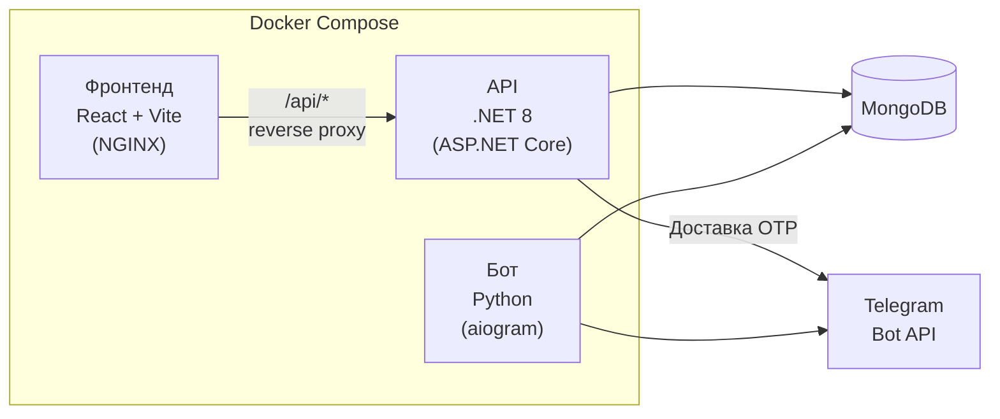
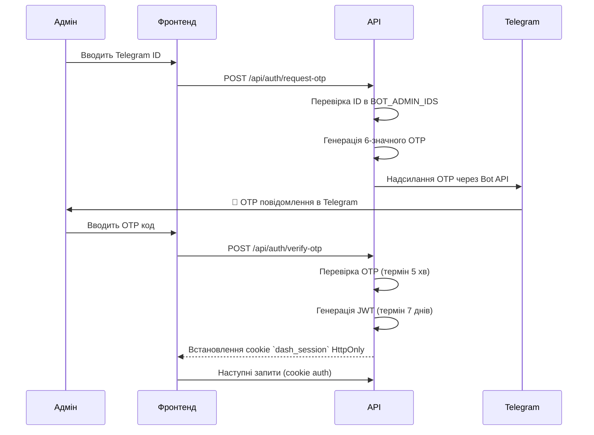

[← Повернутися до змісту](README.md)

# 📊 Огляд дашборда

**Finances Dashboard** — це веб-панель адміністратора, яка надає системним адміністраторам моніторинг у реальному часі, аналітику, управління конфігурацією та операційний контроль над Telegram-ботом — все через браузерний інтерфейс.

## Архітектура

Дашборд є **трирівневим** застосунком:



| Шар | Технологія | Порт | Контейнер |
|---|---|---|---|
| **Фронтенд** | React 18 + MUI 9 + Vite 6 + Recharts | `80` (NGINX) | `finances-frontend` |
| **API** | .NET 8 (ASP.NET Core) + MongoDB.Driver | `8090` | `finances-dashboard` |
| **Бот** | Python 3.11 + aiogram 3.x + Motor | — | `finances-bot` |
| **Кеш** | Redis 7 (опціонально) | `6379` | `finances-redis` |

Усі сервіси використовують один екземпляр MongoDB та спілкуються через Docker bridge мережу `finances_net`. NGINX-контейнер фронтенду проксіює всі `/api/*` запити до .NET API бекенду.

## Потік автентифікації

Дашборд використовує схему автентифікації через **Telegram OTP (одноразовий пароль)**. Лише користувачі, чиї Telegram ID вказані в `BOT_ADMIN_IDS`, мають доступ до дашборда.



### Механізми безпеки

| Функція | Реалізація |
|---|---|
| **Перевірка адміна** | Telegram ID перевіряється проти змінної середовища `BOT_ADMIN_IDS` |
| **Доставка OTP** | Надсилається через Telegram Bot API (`sendMessage`) в особистий чат адміна |
| **Термін OTP** | 5 хвилин, одноразове використання, зберігається в колекції MongoDB `Otps` |
| **Токен сесії** | JWT (HS256), термін 7 днів, зберігається як cookie `dash_session` HttpOnly |
| **Валідація JWT** | Issuer/Audience: `FinancesDashboard`, мінімум 32 символи секретного ключа |
| **Rate limiting NGINX** | Auth ендпоінти: 10 зап/хв, API ендпоінти: 60 зап/хв |
| **Security-заголовки** | X-Frame-Options, CSP, X-Content-Type-Options, Referrer-Policy |

## Сторінки дашборда

Дашборд надає 9 функціональних сторінок, доступних через бічну навігацію:

| Сторінка | Опис |
|---|---|
| **Огляд** | KPI-картки (Загальні користувачі, DAU, WAU, MAU, Premium, Групи, Алерти, Запити), графік активності за 30 днів |
| **Статус бота** | Статус сервісу, використання RAM/CPU, системні ресурси, диск, версія Python, аптайм |
| **База даних** | Метрики MongoDB — розміри колекцій, кількість документів, розміри індексів, пул з'єднань |
| **Парсер** | Здоров'я парсерів Фіат/Крипто/Акцій, мітки останнього оновлення, лог помилок, кількість циклів |
| **Алерти** | Статистика активних/спрацьованих цінових алертів, розподіл по валютах |
| **Групи** | Підрахунок активних/неактивних груп, список останніх реєстрацій |
| **Помилки** | Переглядач логу помилок у реальному часі з мітками часу та рівнями серйозності |
| **Користувачі** | Мовний розподіл (кругова діаграма), топ користувачів за об'ємом запитів |
| **Конфігурація** | Живий редактор `settings.json` зі збереженням по секціях та перемикачами feature-прапорців |

## Конфігурація

### Змінні середовища

API дашборда читає конфігурацію зі змінних середовища (заповнюються з `.env` або Docker Compose):

| Змінна | Обов'язкова | Опис |
|---|---|---|
| `MONGO_URI` | ✅ | Рядок підключення MongoDB |
| `MONGO_DATABASE` | ❌ | Назва бази даних (за замовчуванням: `finances`) |
| `BOT_TOKEN` | ✅ | Токен Telegram Bot API (для доставки OTP) |
| `BOT_ADMIN_IDS` | ✅ | Telegram ID адмінів через кому |
| `JWT_SECRET` / `DASHBOARD_SECRET_KEY` | ✅ | Ключ підпису JWT (мін. 32 символи) |
| `CONFIG_PATH` | ❌ | Шлях до `settings.json` (за замовчуванням: `../../config/settings.json`) |

### Безпека конфігурації

API дашборда маскує чутливі поля при поверненні конфігурації на фронтенд:
- `bot.token` → `**********************`
- `database.mongo_uri` → `mongodb://**********************`

Редагування секцій `api_keys`, `bot`, `database` та `security` через дашборд **заблоковано** (HTTP 403).

## Деплой

### Docker Compose (рекомендовано)

Дашборд деплоїться разом з ботом через `docker-compose.yml` проєкту:

```bash
docker compose up -d
```

Це запускає 4 контейнери:
1. `finances-bot` — Telegram-бот
2. `finances-dashboard` — .NET 8 API (порт 8090, внутрішній)
3. `finances-frontend` — NGINX з React SPA + reverse proxy (порт 80)
4. `finances-redis` — Опціональний Redis-кеш

### Standalone (systemd)

Для legacy-деплоїв API може працювати як systemd-сервіс через `dashboard/finances-dashboard.service`. React-фронтенд обслуговується окремою конфігурацією NGINX (`dashboard/nginx/finances-dashboard.conf`).

### NGINX Reverse Proxy

Конфігурація NGINX забезпечує:
- **SPA маршрутизація** — всі не-API шляхи перенаправляються на `index.html`
- **Кешування ассетів** — Vite-хешовані файли `/assets/` кешуються на 1 рік з `immutable`
- **Rate limiting** — окремі зони для auth (10 зап/хв) та загального API (60 зап/хв)
- **Security-заголовки** — повний CSP, XSS-захист, заборона фреймів
- **Gzip-стиснення** — увімкнено для text, JSON, JS, CSS та SVG
- **Обробка помилок** — JSON-відповіді для 429 та 5xx

---

*Останнє оновлення: 2026-08-19*
