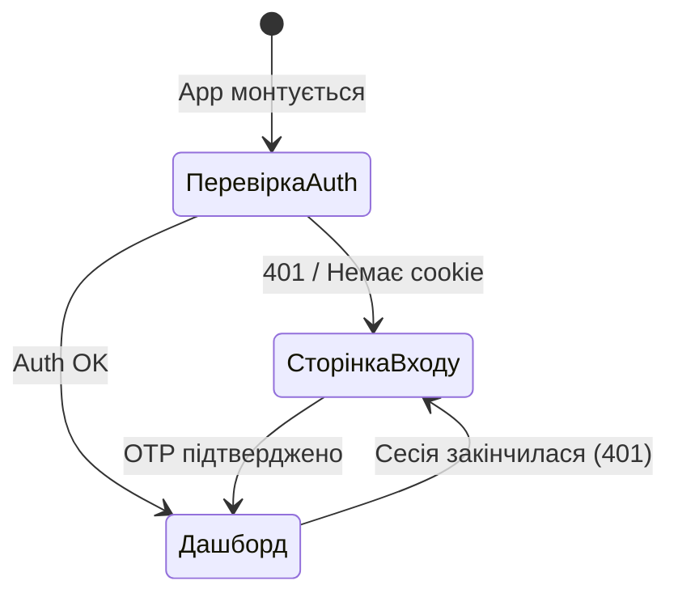

[← Повернутися до змісту](README.md)

# 🖥️ Фронтенд дашборда

Фронтенд дашборда — це **React 18** односторінковий застосунок (SPA), побудований на **Vite 6**, **MUI (Material UI) 9** та **Recharts**. Надає інтерактивний адмін-інтерфейс для моніторингу та управління ботом Finances.

## Технологічний стек

| Компонент | Технологія | Версія |
|---|---|---|
| **UI-фреймворк** | React | 18.3 |
| **Інструмент збірки** | Vite | 6.1 |
| **Бібліотека компонентів** | MUI (Material UI) | 9.3 |
| **Таблиці даних** | MUI X Data Grid | 9.11 |
| **Графіки** | Recharts | 2.15 |
| **Іконки** | MUI Icons + Lucide React | 9.3 / 0.475 |
| **Стилізація** | Emotion (CSS-in-JS) | 11.14 |
| **Мова** | TypeScript | 5.7 |

## Структура проєкту

```
dashboard/frontend/
├── index.html                    # HTML точка входу
├── package.json                  # Залежності та скрипти
├── tsconfig.json                 # Конфігурація TypeScript
├── vite.config.ts                # Конфіг Vite (аліаси, proxy, збірка)
├── nginx.conf                    # Production NGINX конфіг (Docker)
├── Dockerfile.frontend           # Docker збірка для NGINX
├── src/
│   ├── main.tsx                  # Монтування React DOM root
│   ├── App.tsx                   # Кореневий компонент — auth gate, роутинг, завантаження даних
│   ├── index.css                 # Глобальні CSS-стилі
│   ├── api/
│   │   └── client.ts             # API-клієнт — типізована обгортка fetch + виклики всіх ендпоінтів
│   ├── lib/
│   │   └── utils.ts              # Утилітні функції
│   ├── hooks/                    # Кастомні React-хуки (зарезервовано)
│   └── components/
│       ├── auth/
│       │   └── LoginPage.tsx     # Потік входу через Telegram OTP (2 кроки)
│       ├── layout/
│       │   ├── Sidebar.tsx       # Бічна навігація зі статусними бейджами
│       │   └── Header.tsx        # Верхня панель — назва сторінки, оновлення, вихід, перезапуск
│       ├── pages/
│       │   ├── OverviewPage.tsx  # KPI-картки + графік активності
│       │   ├── BotStatusPage.tsx # Статистика процесу + системні ресурси
│       │   ├── DatabasePage.tsx  # Таблиця статистики колекцій
│       │   ├── ParserPage.tsx    # Здоров'я парсера + список помилок
│       │   ├── AlertsPage.tsx    # Статистика алертів
│       │   ├── GroupsPage.tsx    # Статистика груп
│       │   ├── ErrorsPage.tsx    # Переглядач логу помилок
│       │   ├── UsersPage.tsx     # Мовний розподіл + топ користувачів
│       │   └── ConfigPage.tsx    # Живий редактор конфігурації + перемикачі
│       └── ui/                   # Спільні UI-компоненти (зарезервовано)
```

## Архітектура застосунку

### Кореневий компонент (`App.tsx`)

Компонент `App` управляє всім життєвим циклом застосунку:



**Ключові відповідальності:**

1. **Auth gate** — при монтуванні намагається викликати `/api/stats/overview`. Якщо успішно — користувач автентифікований. Якщо 401 — перенаправлення на вхід.
2. **Hash-роутинг** — URL-хеш (`#overview`, `#bot`, `#database` тощо) визначає активну сторінку.
3. **Завантаження даних** — `fetchPageData()` завантажує дані поточної сторінки при монтуванні, зміні сторінки та кожні 30 секунд автоматично.
4. **Управління станом** — всі дані зберігаються в React `useState` хуках. Зовнішня бібліотека стану не використовується.

### API-клієнт (`api/client.ts`)

API-клієнт — це єдиний модуль, що експортує:

1. **TypeScript-інтерфейси** для всіх типів відповідей API
2. **Типізовану функцію `req<T>()`** — обгортку fetch з cookies та обробкою помилок
3. **Об'єкт `api`** з методами для кожного ендпоінта

## Сторінки

### Сторінка входу (`LoginPage.tsx`)

Двокроковий потік автентифікації:
1. **Крок 1**: Адмін вводить свій Telegram User ID. Фронтенд викликає `requestOtp()`, що надсилає 6-значний OTP у чат Telegram.
2. **Крок 2**: Адмін вводить 6-значний OTP використовуючи окремі поля введення для кожної цифри.

### Сторінка огляду (`OverviewPage.tsx`)

- **KPI-картки**: Загальні користувачі, DAU, WAU, MAU, Premium, Активні групи, Алерти, Запити Сьогодні/Тиждень, Помилки, Цикли парсера, Ретенція.
- **Графік активності**: 30-денний лінійний графік Recharts з DAU та об'ємом запитів.

### Сторінка статусу бота (`BotStatusPage.tsx`)

- **Статус сервісу**: Індикатор запущено/зупинено з аптаймом.
- **Метрики процесу бота**: RAM (МБ), CPU (%), PID, кількість потоків.
- **Системні ресурси**: Загальна/використана RAM (ГБ), CPU (%), ядра, load average.
- **Диск**: Використано/загальний (ГБ), відсоток використання.

### Сторінка бази даних (`DatabasePage.tsx`)

- **Підсумкові картки**: Загальний розмір (МБ), розмір сховища, розмір індексів, кількість колекцій, з'єднання, версія MongoDB.
- **Таблиця колекцій**: Розбивка по колекціях — назва, кількість документів, розмір (КБ), середній розмір документа.

### Сторінка конфігурації (`ConfigPage.tsx`)

- **Редактори секцій**: Розгортаємі панелі для секцій `parser`, `i18n`, `security`, `features`, `draft`, `redis`, `sentry`.
- **Feature-перемикачі**: Inline булеві перемикачі для `mini_app_enabled`, `groups_enabled`, `inline_mode_enabled`.
- **Секції лише для читання**: `bot`, `database`, `api_keys`, `security` відображаються, але не можуть бути змінені.

## Збірка та розробка

### Сервер розробки

```bash
cd dashboard/frontend
npm install
npm run dev
```

Запускає Vite dev-сервер на `http://localhost:5173` з гарячим перезавантаженням модулів. API-виклики проксіюються на `http://127.0.0.1:8090` через вбудований proxy Vite.

### Production-збірка

```bash
npm run build
```

Виводить оптимізовані ассети в `dashboard/frontend/dist/` з:
- **Розділення коду**: `vendor` (React/ReactDOM), `charts` (Recharts), `icons` (Lucide) як окремі чанки.
- **Source maps**: Вимкнені в production.
- **TypeScript**: Компілюється через `tsc` перед бандлінгом Vite.

---

*Останнє оновлення: 2026-08-19*
